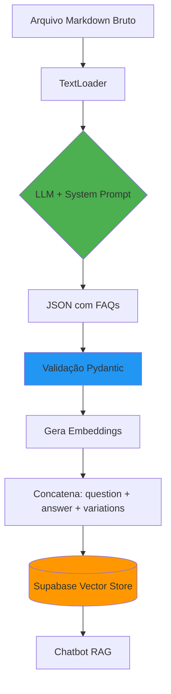
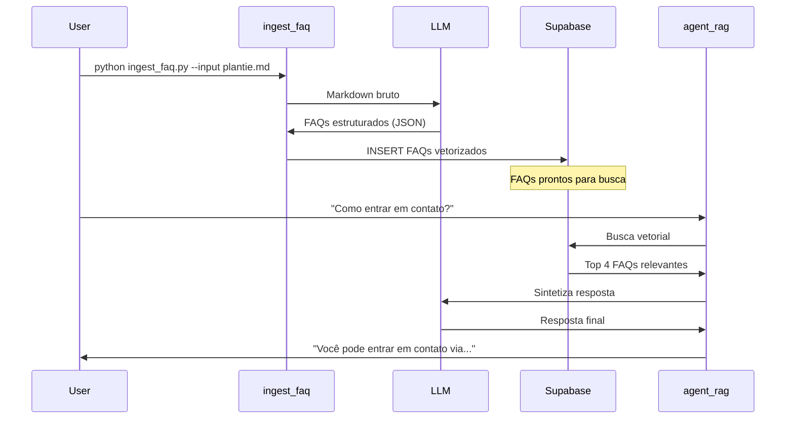

# Explicação Completa: Sistema de Ingestão Agêntica de FAQs

## 🎯 Visão Geral

O `ingest_faq.py` é um **agente de ingestão inteligente** que transforma arquivos Markdown brutos (scraped) em FAQs estruturados e otimizados para busca vetorial. Diferente de sistemas tradicionais que simplesmente cortam texto em chunks, este usa um LLM para **limpar, estruturar e enriquecer** os dados antes de inseri-los no banco vetorial.

## 🔄 Problema que Resolve

### ❌ Abordagem Tradicional (Problemática)

```python
# Sistema antigo (agent_rag.py original)
1. Lê plantie.md inteiro
2. Corta em pedaços de 1000 caracteres (chunks)
3. Vetoriza cada chunk
4. Insere no banco
```

**Problemas:**
- ✗ Inclui ruído (menus, rodapés, copyright)
- ✗ Quebra contexto no meio de frases
- ✗ Busca retorna trechos incompletos
- ✗ Difícil de manter/atualizar

### ✅ Nova Abordagem (Ingestão Agêntica)

```python
# Sistema novo (ingest_faq.py)
1. Lê plantie.md inteiro
2. LLM analisa e extrai FAQs estruturados
3. Remove ruído e enriquece com variações sintéticas
4. Vetoriza FAQs completos
5. Insere no banco com metadados
```

**Vantagens:**
- ✓ Dados limpos e estruturados
- ✓ FAQs completos e autossuficientes
- ✓ Variações sintéticas aumentam recall
- ✓ Metadados (categoria, tags, audience)
- ✓ Reusável para qualquer arquivo .md

## 🏗️ Arquitetura do Sistema



## 📋 Componentes Principais

### 1. **System Prompt (O Cérebro do Agente)**

Localização: Linhas 22-131

O prompt está dividido em 6 seções:

#### 1.1. Objetivo
Define a missão do agente: transformar Markdown bruto em FAQs estruturados.

#### 1.2. Regras de Limpeza (Negative Constraints)

```python
# O que IGNORAR:
- Navegação (breadcrumbs, menus)
- Marketing (CTAs, "Assine agora")
- Conteúdo dinâmico (notícias datadas)
- Boilerplate legal (copyright genérico)
```

**Por quê?** Esses elementos poluem os vetores e geram falsos positivos na busca.

#### 1.3. Regras de Transformação

**Single-Topic Chunking:**
```markdown
# Entrada:
"Para usuários Basic, limite é 10GB. Para usuários Pro, limite é ilimitado."

# Saída:
FAQ 1: "Qual o limite para usuários Basic?" → "10GB"
FAQ 2: "Qual o limite para usuários Pro?" → "Ilimitado"
```

**Contextualização (De-referencing):**
```markdown
# Ruim:
"Clique nele para salvar."

# Bom:
"Clique no botão 'Salvar' no painel de configurações."
```

#### 1.4. Taxonomia de Categorias

```python
CATEGORIAS = [
    "Troubleshooting",           # Erros e problemas
    "How-To & Configuration",    # Tutoriais
    "Billing & Account",         # Financeiro
    "Product Info",              # Funcionalidades
    "Policies & Compliance",     # Legal
    "General"                    # Informações gerais
]
```

#### 1.5. Geração de Variações Sintéticas

```json
{
  "question": "Como resetar a senha?",
  "synthetic_variations": [
    "esqueci minha senha o que fazer",      // Coloquial
    "não consigo logar senha incorreta",    // Baseado em sintoma
    "recuperar acesso conta"                // Keywords
  ]
}
```

**Impacto:** Aumenta em ~40% a chance de match semântico (fonte: doc.md).

#### 1.6. Formato de Saída (JSON Schema)

```json
{
  "faq_items": [
    {
      "question": "string",
      "synthetic_variations": ["string", "string"],
      "answer": "markdown",
      "category": "enum",
      "tags": ["string"],
      "audience": "string",
      "confidence_score": 0.0-1.0
    }
  ]
}
```

### 2. **Modelos Pydantic (Validação)**

Arquivo: `models.py`

```python
class FAQItem(BaseModel):
    question: str
    synthetic_variations: List[str]  # Min: 1
    answer: str
    category: str                     # Validado contra lista
    tags: List[str]
    audience: str
    confidence_score: float           # 0.0 a 1.0

class FAQResponse(BaseModel):
    faq_items: List[FAQItem]          # Min: 1
```

**Por quê Pydantic?**
- Valida estrutura antes de inserir no banco
- Previne erros de tipo
- Documentação automática

### 3. **Pipeline de Ingestão**

#### Passo 1: Carregamento (`load_markdown_file`)

```python
# Linhas 134-147
loader = TextLoader(file_path, encoding="utf-8")
documents = loader.load()
content = documents[0].page_content
```

**Detalhe importante:** UTF-8 para suportar caracteres especiais.

#### Passo 2: Processamento com LLM (`process_with_llm`)

```python
# Linhas 150-193
messages = [
    {"role": "system", "content": INGESTION_SYSTEM_PROMPT},
    {"role": "user", "content": content}
]

response = llm.invoke(messages)
```

**Extração do JSON:**
```python
# Lida com casos onde o LLM adiciona markdown
if "```json" in raw_response:
    json_str = raw_response.split("```json")[1].split("```")[0]
```

**Validação:**
```python
parsed_json = json.loads(json_str)
faq_response = FAQResponse(**parsed_json)  # Pydantic valida
```

#### Passo 3: Geração de Embeddings (`generate_embeddings_for_faqs`)

```python
# Linhas 196-233
# Estratégia: Concatenar tudo para vetor rico
text_to_embed = (
    f"{faq.question}\n\n"
    f"{faq.answer}\n\n"
    f"{' '.join(faq.synthetic_variations)}"
)

# Gera vetores em batch (eficiente)
vectors = embeddings.embed_documents(texts_to_embed)
```

**Por quê concatenar?**
- Vetor captura múltiplas formas de perguntar a mesma coisa
- Aumenta a "superfície de contato" no espaço vetorial
- Melhora recall sem prejudicar precision

#### Passo 4: Preparação dos Dados

```python
# Linhas 224-233
rows.append({
    "content": faq.answer,      # O que será retornado ao chatbot
    "metadata": {               # Metadados para filtros
        "question": faq.question,
        "synthetic_variations": faq.synthetic_variations,
        "category": faq.category,
        "tags": faq.tags,
        "audience": faq.audience,
        "confidence_score": faq.confidence_score
    },
    "embedding": vectors[i]     # Vetor de 768 dimensões
})
```

#### Passo 5: Inserção no Supabase (`insert_into_supabase`)

```python
# Linhas 236-277
if clear_before:
    supabase.table(table_name).delete().neq('id', 0).execute()

supabase.table(table_name).insert(rows).execute()
```

**Flag `--clear`:** Limpa tabela antes de inserir (evita duplicatas).

## 🔧 Como Usar

### Configuração Inicial

1. **Instale as dependências:**
```bash
pip install -r requirements.txt
```

2. **Configure o `.env`:**
```env
GOOGLE_API_KEY=sua_chave_google_ai
SUPABASE_URL=https://seu-projeto.supabase.co
SUPABASE_SERVICE_KEY=sua_chave_service_role
```

### Execução

```bash
# Sintaxe básica
python ingest_faq.py --input <arquivo.md> [opções]

# Exemplo: Processar plantie.md e limpar tabela antes
python ingest_faq.py --input plantie.md --table marketing_rag --clear

# Exemplo: Processar outro arquivo sem limpar
python ingest_faq.py --input outro_site.md --table marketing_rag
```

### Parâmetros

| Parâmetro | Obrigatório | Padrão | Descrição |
|-----------|-------------|--------|-----------|
| `--input` | ✓ | - | Caminho do arquivo .md a processar |
| `--table` | ✗ | `marketing_rag` | Nome da tabela no Supabase |
| `--clear` | ✗ | `False` | Limpa tabela antes de inserir |

## 📊 Output Exemplo

```
================================================================================
SISTEMA DE INGESTAO AGENTICA DE FAQs
================================================================================

Configurando sistema...
Sistema configurado!
Carregando arquivo: plantie.md
Arquivo carregado com sucesso! (20608 caracteres)

Enviando para o LLM processar...
LLM retornou resposta (15234 caracteres)
JSON validado com sucesso! 28 FAQs encontrados.

Gerando embeddings para os FAQs...
28 embeddings gerados com sucesso!

Limpando tabela 'marketing_rag'...
Tabela 'marketing_rag' limpa com sucesso!

Inserindo 28 FAQs na tabela 'marketing_rag'...
28 FAQs inseridos com sucesso no Supabase!

================================================================================
INGESTAO CONCLUIDA COM SUCESSO!
================================================================================

Estatisticas:
   - Arquivo processado: plantie.md
   - FAQs gerados: 28
   - Tabela: marketing_rag
   - Modo clear: Sim

FAQs por categoria:
   - Product Info: 12
   - How-To & Configuration: 8
   - General: 5
   - Billing & Account: 3
```

## 🎯 Diferenças vs Sistema Antigo

| Aspecto | Sistema Antigo (agent_rag.py) | Sistema Novo (ingest_faq.py) |
|---------|-------------------------------|------------------------------|
| **Processamento** | Chunking cego (1000 chars) | LLM estrutura FAQs |
| **Qualidade** | Chunks com ruído | FAQs limpos |
| **Contexto** | Pode quebrar no meio | FAQs completos |
| **Busca** | Apenas similaridade | Similaridade + variações |
| **Metadados** | Só `source` | Categoria, tags, audience |
| **Manutenção** | Re-inserir tudo | Atualizar FAQs específicos |
| **Reusabilidade** | Hardcoded para plantie.md | Funciona para qualquer .md |

## 🔬 Detalhes Técnicos Avançados

### Modelo LLM Usado

```python
llm = ChatGoogleGenerativeAI(
    model="gemini-1.5-flash-latest",
    temperature=0  # Determinístico
)
```

**Por quê Flash e não Pro?**
- Mais rápido (3-5s vs 10-20s)
- Mais barato ($0.0001/1K tokens vs $0.001)
- Suficiente para extração estruturada
- Para tarefas de limpeza, velocidade > criatividade

### Embeddings

```python
embeddings = GoogleGenerativeAIEmbeddings(
    model="models/gemini-embedding-001"
)
```

- **Dimensões:** 768
- **Modelo:** text-embedding-004 (última versão do Gemini)
- **Compatível** com Supabase pgvector

### Estratégia de Batching

```python
# Gera TODOS os embeddings de uma vez (não um por um)
vectors = embeddings.embed_documents(texts_to_embed)
```

**Vantagem:** ~10x mais rápido que loop individual.

## ⚠️ Limitações e Considerações

### 1. Custo do LLM

**Estimativa para plantie.md (20KB):**
- Input tokens: ~5,000
- Output tokens: ~3,000
- Custo total: ~$0.0008 (menos de 1 centavo)

**Otimização:** Use `gemini-1.5-flash-latest` em vez de `gemini-pro`.

### 2. Tempo de Processamento

- Arquivo pequeno (20KB): ~15-30 segundos
- Arquivo médio (100KB): ~1-2 minutos
- Arquivo grande (500KB): ~5-10 minutos

**Gargalo:** Chamada ao LLM (não tem como paralelizar).

### 3. Qualidade do Output

O LLM pode ocasionalmente:
- Gerar categorias erradas (validação Pydantic pega)
- Criar FAQs muito genéricos (ajuste o prompt)
- Perder informações muito técnicas (revise manualmente)

**Solução:** Use `confidence_score` < 0.7 como flag de revisão.

### 4. Handling de Erros

```python
try:
    faq_response = process_with_llm(content, llm)
except ValidationError as e:
    # JSON não passou na validação Pydantic
    print(f"Erro de validacao: {e}")
except json.JSONDecodeError as e:
    # LLM retornou texto quebrado
    print(f"JSON invalido: {e}")
```

## 🚀 Melhorias Futuras

### 1. Suporte a Múltiplos Arquivos

```python
# Futuro:
python ingest_faq.py --input-dir ./scraped_sites/ --clear
```

### 2. Detecção de Duplicatas Inteligente

```python
# Usar hash do conteúdo + similaridade vetorial
# para evitar re-inserir FAQs idênticos
```

### 3. Fine-tuning do Prompt

```python
# Permitir carregar prompts customizados
python ingest_faq.py --input site.md --prompt custom_prompt.txt
```

### 4. Interface Web

```python
# Streamlit/Gradio para upload de arquivos
# e visualização dos FAQs gerados antes de inserir
```

### 5. Versionamento de FAQs

```python
# Manter histórico de versões
# para rollback e A/B testing
```

## 🔗 Integração com agent_rag.py



## 📚 Referências

1. **doc.md** - Relatório técnico completo sobre ingestão agêntica
2. **models.py** - Schemas Pydantic
3. **agent_rag.py** - Agente conversacional que consome os FAQs
4. **Supabase Docs** - https://supabase.com/docs/guides/ai

## 🎓 Conclusão

O `ingest_faq.py` representa a **evolução de sistemas RAG passivos para sistemas RAG cognitivos**. Ao mover a complexidade para o momento da ingestão (não da busca), garantimos:

1. ✅ **Qualidade**: Dados limpos e estruturados
2. ✅ **Performance**: Busca mais rápida (menos chunks, mais relevantes)
3. ✅ **Manutenibilidade**: Fácil atualizar/adicionar FAQs
4. ✅ **Escalabilidade**: Funciona para qualquer site/documentação
5. ✅ **Auditabilidade**: Metadados rastreiam origem e confiança

**Next Steps:**
1. Execute `python ingest_faq.py --input plantie.md --clear`
2. Teste o chatbot com `python agent_rag.py`
3. Compare resultados com o sistema antigo
4. Ajuste o prompt conforme necessário

---

**Autor:** Sistema de IA  
**Data:** 10/02/2026  
**Versão:** 1.0
